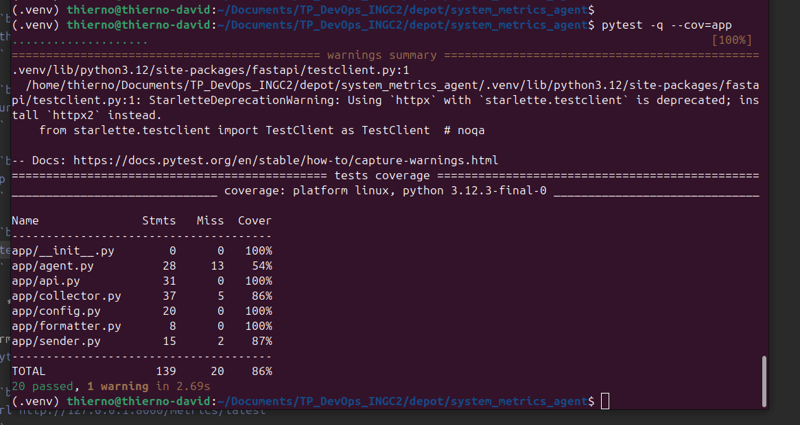
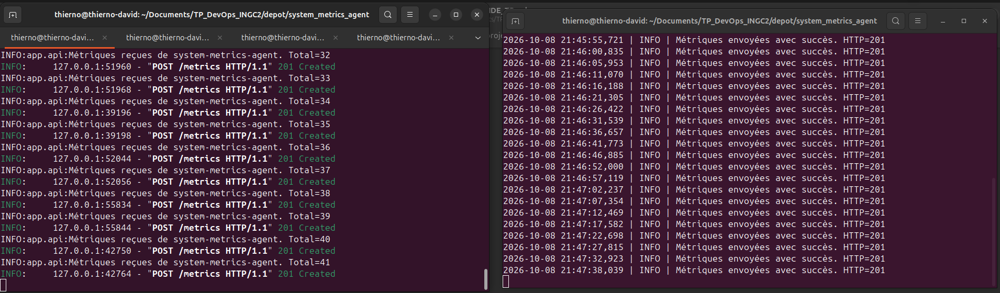
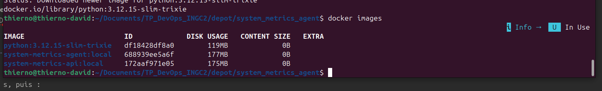
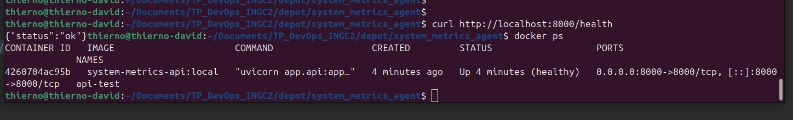
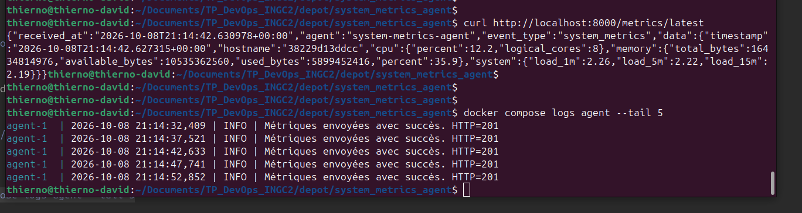
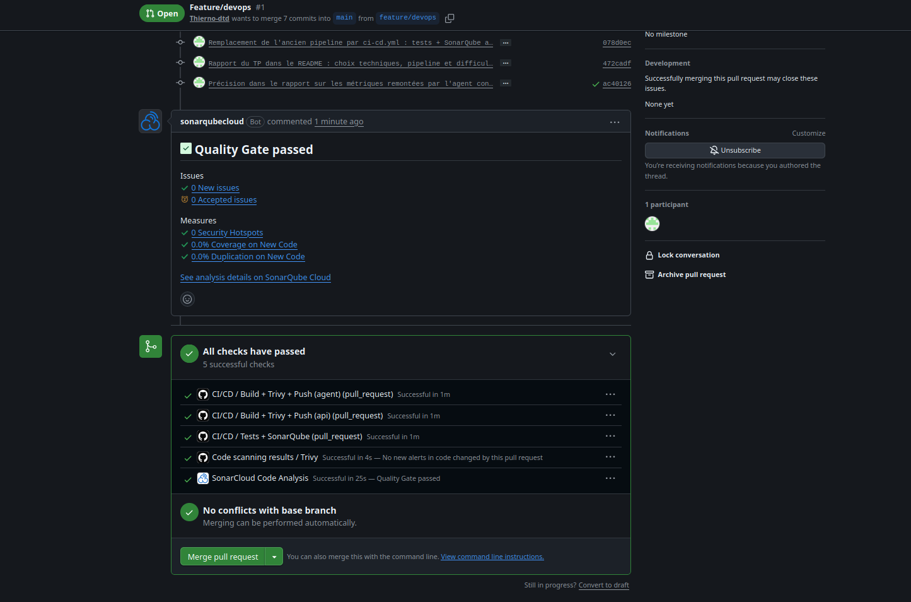
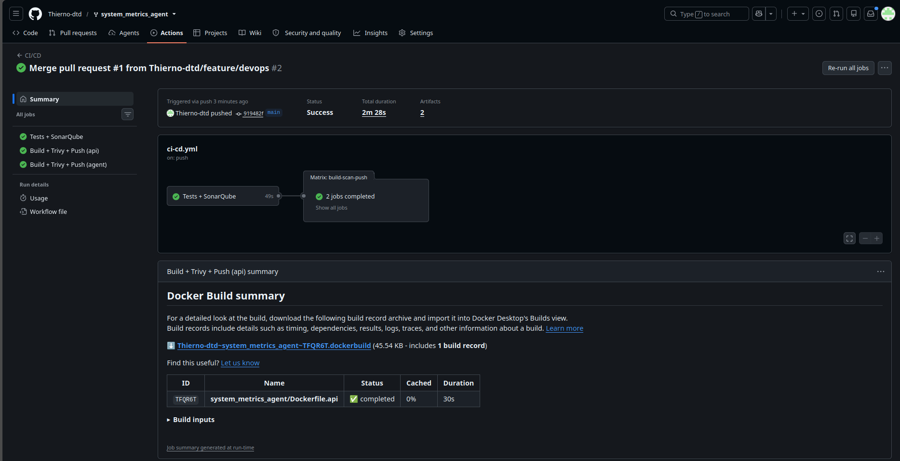
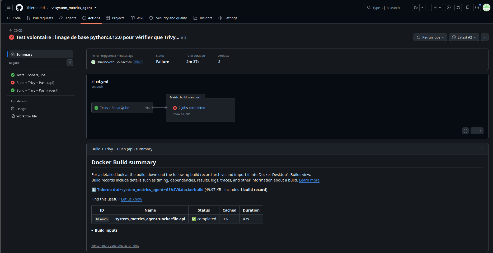
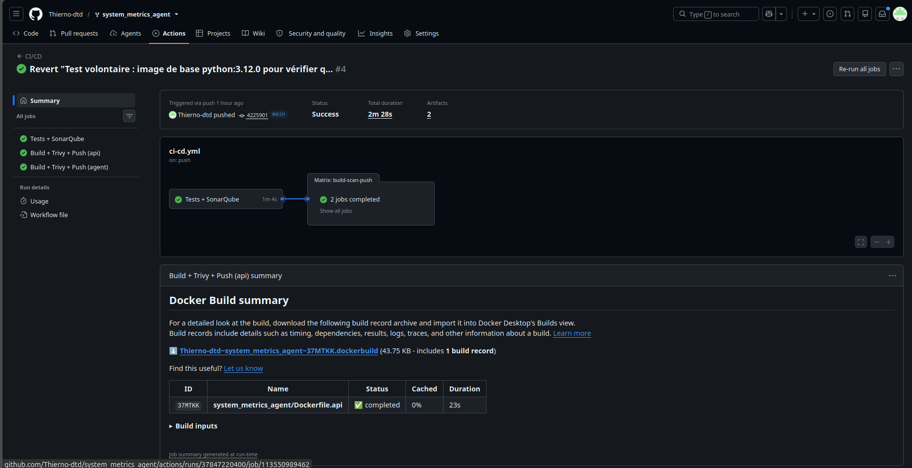
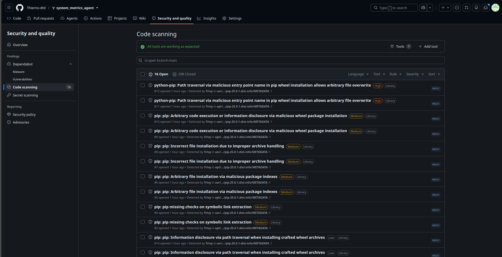

# System Metrics Agent

Agent Python qui collecte CPU, RAM et charge système (psutil + commande
`uptime`) et les envoie à une API FastAPI. Ce fork contient le travail du TP
DevOps INGC2 : conteneurisation, Docker Compose et pipeline CI/CD.

## Rapport TP DevOps (INGC2)

**Étudiant :** DOUTHE Thierno David · **Travail :** individuel · rendu par mail
(absent à la séance de validation). Les captures de chaque étape sont dans
[la section Démarche et preuves](#démarche-et-preuves) plus bas.

| Livrable | Lien |
|---|---|
| Fork | https://github.com/Thierno-dtd/system_metrics_agent |
| Image API | https://hub.docker.com/r/thiernodtd/system-metrics-api |
| Image agent | https://hub.docker.com/r/thiernodtd/system-metrics-agent |
| Pipeline vert (après correction) | https://github.com/Thierno-dtd/system_metrics_agent/actions/runs/37847220400 |
| Pipeline rouge (échec Trivy volontaire) | https://github.com/Thierno-dtd/system_metrics_agent/actions/runs/37846641326 |
| Pull request `feature/devops` → `main` | https://github.com/Thierno-dtd/system_metrics_agent/pull/1 |

### Choix techniques

- **Image de base `python:3.12.15-slim-trixie`.** Version figée jusqu'au patch
  et à la distribution, jamais `latest`, pour que deux builds à une semaine
  d'écart donnent la même chose. J'ai écarté Alpine : psutil et uvloop n'y ont
  pas toujours de wheel, il faudrait compiler (gcc, headers), et musl ne se
  comporte pas comme glibc. Le gain de taille ne compense pas ce risque.
- **Multi-stage.** Le stage `builder` crée un virtualenv dans `/opt/venv` et
  installe les dépendances ; l'image finale ne récupère que ce dossier et le
  code. `requirements.txt` est copié avant le code, donc tant qu'il ne change
  pas, la couche pip reste en cache. `pip install --no-cache-dir`.
- **Dépendances séparées.** `requirements.txt` ne contient que le runtime ;
  pytest, black, flake8 et httpx2 sont dans `requirements-dev.txt` et
  n'arrivent pas en production. Les versions sont figées, Dependabot propose
  les mises à jour.
- **Sécurité.** Utilisateur système non-root (UID 10001), aucun secret dans
  l'image, `.env` exclu par le `.dockerignore` (avec `.git`, `.venv`, `tests`,
  les caches).
- **Prod.** `uvicorn` sans `--reload`, sur `0.0.0.0:8000`, `EXPOSE 8000`. Le
  `HEALTHCHECK` passe par `urllib` de Python, car curl n'est pas dans l'image
  slim et ajouter un paquet juste pour ça n'avait pas de sens.
- **`uptime` dans l'agent.** La commande n'existe pas dans l'image slim, le
  collecteur aurait levé une erreur à chaque cycle. Elle est fournie par le
  paquet Debian `procps`, installé avec `--no-install-recommends` dans l'image
  de l'agent uniquement.
- **Config à l'exécution.** `METRICS_ENDPOINT`, `COLLECTION_INTERVAL` et
  `REQUEST_TIMEOUT` ne sont pas figés dans l'image : ils viennent du `.env` via
  Compose ou de `-e` avec `docker run`.

**Tailles (`docker images`) :** API 175 Mo, agent 177 Mo, pour 119 Mo d'image
de base. Les dépendances Python ajoutent donc environ 56 Mo, `procps` 2 Mo.
Compressées sur Docker Hub : environ 62 Mo chacune.

**Agent conteneurisé et vraies métriques.** Docker ne virtualise pas
`/proc/meminfo` ni `/proc/loadavg` : l'agent lancé par Compose remonte
16 434 814 976 octets de RAM totale, soit toute la mémoire de mon PC Ubuntu
(16 Go), et la charge de la machine. Il ignore donc les limites cgroup de son
conteneur, et il envoie l'ID du conteneur (`38229d13ddcc`) comme hostname au
lieu du nom de la machine. En vrai déploiement, il faut soit installer l'agent
directement sur la machine (service systemd), soit le lancer avec `pid: host`,
le `/proc` de l'hôte monté en lecture seule et le vrai hostname, comme le fait
node-exporter de Prometheus.

### Pipeline (`.github/workflows/ci-cd.yml`)

Déclenché sur `push` et `pull_request` vers `main`. Job `test` : pytest avec
couverture XML, puis analyse SonarQube Cloud avec `sonar.qualitygate.wait=true`,
qui fait échouer le job si la Quality Gate n'est pas validée. Job
`build-scan-push` (`needs: test`, matrice api/agent) : build avec
`load: true`, scan Trivy bloquant (`exit-code: 1`) sur les vulnérabilités
HIGH/CRITICAL corrigeables, puis `docker push` des tags SHA et `latest`
uniquement sur un push vers `main`. Je pousse l'image qui vient d'être
scannée, pas un rebuild. L'action Trivy est épinglée sur un SHA de commit,
parce que ses tags ont été détournés lors de l'attaque de mars 2026. Bonus :
cache `type=gha`, rapport Trivy en SARIF dans l'onglet Security, Dependabot.

Secrets GitHub : `DOCKERHUB_USERNAME`, `DOCKERHUB_TOKEN` (access token, pas le
mot de passe), `SONAR_TOKEN`, `SONAR_HOST_URL`. Aucun secret dans le dépôt.

**Échec volontaire.** Sur `main`, j'ai remplacé l'image de base de l'API par
`python:3.12.0-slim-bookworm` (octobre 2023), commit `a4ea582`. Les tests et
Sonar passent, le build de l'image aussi, mais le step « Scan Trivy
(bloquant) » du job API échoue sur des vulnérabilités HIGH/CRITICAL
corrigeables et le step « Push sur Docker Hub » est sauté. On le voit sur
Docker Hub : `system-metrics-agent` a un tag `a4ea582...`, `system-metrics-api`
n'en a pas. L'agent, lui, est jugé séparément et a été poussé. Après
`git revert` (`4225901`), le pipeline est redevenu vert ; l'onglet Security
a refermé automatiquement 298 alertes, celles de la vieille image.

### Difficultés rencontrées

- Les tests étaient dans `app/tests/` alors que le README d'origine annonçait
  `tests/` et un `test_api.py` qui n'existait pas. Je les ai déplacés à la
  racine et j'ai écrit les tests de l'API, de la config et de l'agent
  (20 tests, 86 % de couverture).
- Sur mon PC Windows, `pytest -q` échouait sur deux tests du collecteur alors
  qu'ils passaient sous Ubuntu : `get_load_average` renvoie `None` sous
  Windows sans appeler `uptime`, donc le mock n'était jamais utilisé. La
  plateforme est maintenant simulée dans les tests.
- J'avais d'abord remplacé `httpx2` par `httpx`, en pensant que le
  `TestClient` de FastAPI avait besoin de `httpx`. C'était une erreur :
  sous Ubuntu, pytest affichait `StarletteDeprecationWarning: Using httpx
  with starlette.testclient is deprecated; install httpx2 instead`. Starlette
  1.x utilise `httpx2` ; je l'ai remis et l'avertissement a disparu.
- L'ancien `pipeline.yaml` visait Python 3.14.6 et déployait par SSH vers un
  chemin Windows : je l'ai remplacé. `app/montFichier.py` (import inutilisé,
  code mort) a été supprimé.

**Piste d'amélioration.** Les 16 alertes encore ouvertes dans l'onglet
Security concernent toutes `pip 25.0.1`, présent dans l'image Python et dans
le venv. Aucune n'est classée HIGH/CRITICAL corrigeable par Trivy (sinon le
pipeline serait rouge), mais pip ne sert qu'à l'installation : le désinstaller
de l'image finale supprimerait ces alertes et réduirait encore la surface.

## Démarche et preuves

### Partie 1 : fork, branche, tests

Fork de `Mficius/system_metrics_agent`, travail sur la branche
`feature/devops` (7 commits), fusionnée dans `main` par la pull request #1.



API (`uvicorn app.api:app`) et agent (`python -m app.agent`) lancés en local
sous Ubuntu : l'agent envoie une métrique toutes les 5 s, l'API répond
`201 Created`.



### Partie 2 : images Docker



`docker run` de l'API : `/health` répond et le conteneur est `(healthy)`.



### Partie 3 : Docker Compose

`docker compose up --build -d`, puis `curl http://localhost:8000/metrics/latest` :
la métrique vient bien de l'agent conteneurisé (hostname = ID du conteneur,
charge système remplie grâce à `procps`).



### Partie 4 : pipeline

Pull request : tests, Quality Gate SonarQube Cloud validée, build et scan
Trivy des deux images ; pas de push (ce n'est pas `main`).



Merge sur `main` : pipeline vert et images poussées sur Docker Hub.



Échec volontaire : job API rouge au scan Trivy, push bloqué.



Après le revert : de nouveau vert.



Bonus : résultats Trivy publiés dans l'onglet Security (SARIF).



## Lancer le projet

### En local (Python 3.11+)

```bash
python3 -m venv .venv
source .venv/bin/activate
pip install -r requirements-dev.txt
uvicorn app.api:app --reload     # terminal 1
python -m app.agent              # terminal 2
pytest -q --cov=app
```

Sans `.env`, l'agent envoie par défaut vers `http://127.0.0.1:8000/metrics`.

### Avec Docker Compose

```bash
cp .env.example .env
docker compose up --build -d
curl http://localhost:8000/metrics/latest
```

## Endpoints

| Méthode | Route | Rôle |
|---|---|---|
| GET | `/health` | état de l'API (`{"status": "ok"}`) |
| POST | `/metrics` | réception d'une métrique (201) |
| GET | `/metrics` | toutes les métriques reçues |
| GET | `/metrics/latest` | dernière métrique (404 si aucune) |

## Structure

```text
app/            agent.py, api.py, collector.py, config.py, formatter.py, sender.py
tests/          tests pytest de chaque module
docs/captures/  captures de la démarche
Dockerfile.api  Dockerfile.agent  docker-compose.yml  .dockerignore
sonar-project.properties  .env.example  .github/workflows/ci-cd.yml
```
